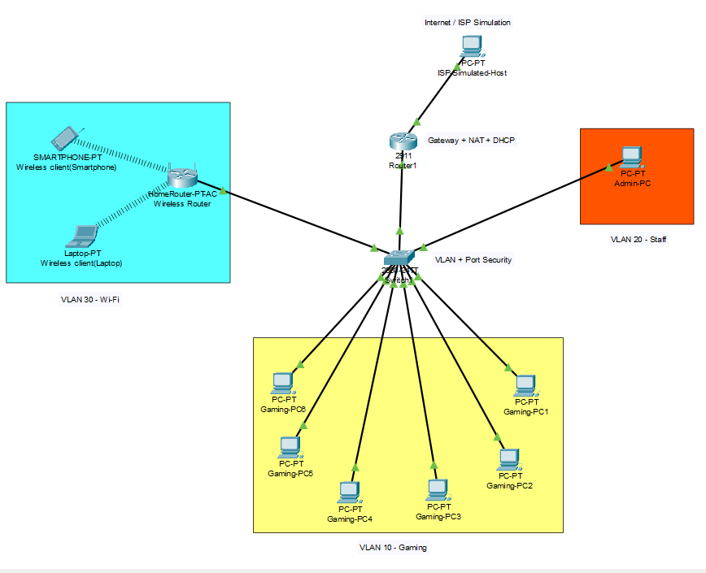
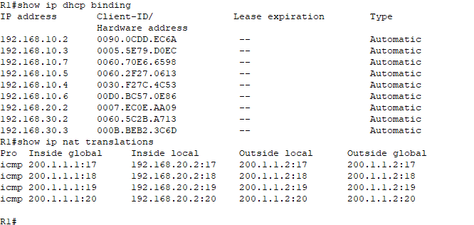

#  Gaming Café Network Simulation (Cisco Packet Tracer)

##  Project Overview

This project simulates a real-world gaming café network using Cisco Packet Tracer.
It includes VLAN segmentation, DHCP automation, NAT for internet access, Wi-Fi integration, QoS, and network security.

---

##  Network Design

### VLANs:

* VLAN 10 — Gaming PCs
* VLAN 20 — Staff Network
* VLAN 30 — Guest Wi-Fi

---

##  Features Implemented

* ✅ VLAN configuration and trunking
* ✅ Inter-VLAN routing (Router-on-a-Stick)
* ✅ DHCP for automatic IP assignment
* ✅ NAT overload (PAT) for internet access
* ✅ Wi-Fi network for customers
* ✅ Access Control Lists (ACLs) for security
* ✅ Port Security on switch
* ✅ QoS for traffic prioritization
* ✅ Network monitoring and troubleshooting

---

##  Network Topology

* Router (R1)
* Switch (SW1)
* Gaming PCs
* Staff PC
* Wireless clients
* Simulated Internet (Cloud/External PC)

---

## 📸 Screenshots

### 🔹 Topology

### 🔹 NAT Verification

---

##  Testing & Verification

* DHCP address assignment verified
* Inter-VLAN communication tested
* Internet connectivity via NAT confirmed
* ACL restrictions validated
* QoS configuration applied
* Monitoring using show/debug commands

---

##  Skills Demonstrated

* Network design and segmentation
* Cisco CLI configuration
* Troubleshooting and debugging
* Network security implementation
* Traffic management (QoS)

---

## 📁 Project Structure

* `/pkt` → Packet Tracer files
* `/configs` → Router and switch configurations
* `README.md` → Project documentation

---

##  Future Improvements

* Add firewall rules
* Implement VPN access
* Upgrade to GNS3 for advanced simulation
* Add monitoring tools (SNMP, NetFlow)

---

##  Author

Kavidu Udayanthe (Ashura Weismann)
